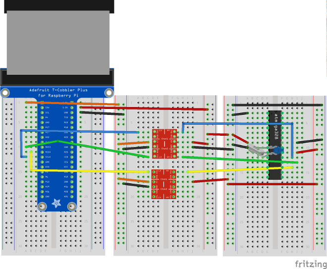

# Installing an SPI-enabled version of avrdude on the Raspberry Pi

## Enable SPI

`sudo raspi-config`

select advanced configuration and turn SPI on

`sudo reboot`

Then

	sudo apt-get update
	sudo apt-get upgrade
	sudo apt-get install bison autoconf make gcc flex
	git clone https://github.com/kcuzner/avrdude.git
	cd avrdude/
	./bootstrap
	./configure
	make
	sudo make install
	./usr/local/bin/avrdude -c

Here's the hardware setup:

When using the software, remember to specify the full path, or you may invoke an unpatched version of avrdude.